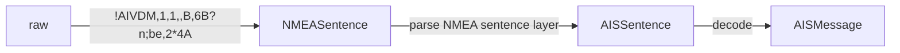

# pyais

[](https://pypi.org/project/pyais/)
[](https://github.com/M0r13n/pyais/blob/master/LICENSE)
[](https://codecov.io/gh/M0r13n/pyais)
[](https://pypi.org/project/pyais/)

[](https://pyais.readthedocs.io/en/latest/?badge=latest)

AIS message encoding and decoding. 100% pure Python. Supports AIVDM/AIVDO messages. Supports single messages, files and
TCP/UDP sockets.

You can find the full documentation on [readthedocs](https://pyais.readthedocs.io/en/latest/).

I also wrote a [blog post about AIS decoding](https://leonrichter.de/posts/pyais/) and this lib.

# Acknowledgements


This project is a grateful recipient of
the [free Jetbrains Open Source sponsorship](https://www.jetbrains.com/?from=pyais). Thank you. 🙇

# General

This module contains functions to decode and parse Automatic Identification System (AIS) serial messages. For detailed
information about AIS refer to
the [AIS standard](https://en.wikipedia.org/wiki/Automatic_identification_system#Message_format).

# Features/Improvements

I open to any form of idea to further improve this library. If you have an idea or a feature request - just open an
issue. :-)

# Installation

The project is available at Pypi:

```shell
$ pip install pyais
```

# Usage

There are many examples in the [examples directory](https://github.com/M0r13n/pyais/tree/master/examples).

Decode a single part AIS message using `decode()`::

```py
from pyais import decode

decoded = decode(b"!AIVDM,1,1,,B,15NG6V0P01G?cFhE`R2IU?wn28R>,0*05")
print(decoded)
```

The `decode()` functions accepts a list of arguments: One argument for every part of a multipart message::

```py
from pyais import decode

parts = [
    b"!AIVDM,2,1,4,A,55O0W7`00001L@gCWGA2uItLth@DqtL5@F22220j1h742t0Ht0000000,0*08",
    b"!AIVDM,2,2,4,A,000000000000000,2*20",
]

# Decode a multipart message using decode
decoded = decode(*parts)
print(decoded)
```

Also the `decode()` function accepts either strings or bytes::

```py
from pyais import decode

decoded_b = decode(b"!AIVDM,1,1,,B,15NG6V0P01G?cFhE`R2IU?wn28R>,0*05")
decoded_s = decode("!AIVDM,1,1,,B,15NG6V0P01G?cFhE`R2IU?wn28R>,0*05")
assert decoded_b == decoded_s
```

Decode the message into a dictionary::

```py
from pyais import decode

decoded = decode(b"!AIVDM,1,1,,B,15NG6V0P01G?cFhE`R2IU?wn28R>,0*05")
as_dict = decoded.asdict()
print(as_dict)
```

Read a file::

```py
from pyais.stream import FileReaderStream

filename = "sample.ais"

for msg in FileReaderStream(filename):
    decoded = msg.decode()
    print(decoded)
```

Decode a stream of messages (e.g. a list or generator)::

```py
from pyais import IterMessages

fake_stream = [
    b"!AIVDM,1,1,,A,13HOI:0P0000VOHLCnHQKwvL05Ip,0*23",
    b"!AIVDM,1,1,,A,133sVfPP00PD>hRMDH@jNOvN20S8,0*7F",
    b"!AIVDM,1,1,,B,100h00PP0@PHFV`Mg5gTH?vNPUIp,0*3B",
    b"!AIVDM,1,1,,B,13eaJF0P00Qd388Eew6aagvH85Ip,0*45",
    b"!AIVDM,1,1,,A,14eGrSPP00ncMJTO5C6aBwvP2D0?,0*7A",
    b"!AIVDM,1,1,,A,15MrVH0000KH<:V:NtBLoqFP2H9:,0*2F",
]
for msg in IterMessages(fake_stream):
    print(msg.decode())
```

## Live feed

The [Norwegian Coastal Administration](https://kystverket.no/navigasjonstjenester/ais/tilgang-pa-ais-data/) offers real-time AIS data.
This live feed can be accessed via TCP/IP without prior registration.
The AIS data is freely available under the [norwegian license for public data](https://data.norge.no/nlod/no/1.0):

Data can be read from a TCP/IP socket and is encoded according to IEC 62320-1:

- IP:   153.44.253.27
- Port: 5631

Refer to the [examples/live_stream.py](./examples/live_stream.py) for a practical example on how to read & decode AIS data from a TCP/IP socket.
This is useful for debugging or for getting used to pyais.

## Encode

It is also possible to encode messages.

| :exclamation:  Every message needs at least a single keyword argument: `mmsi`. All other fields have most likely default values. |
|----------------------------------------------------------------------------------------------------------------------------------|

### Encode data using a dictionary

You can pass a dict that has a set of key-value pairs:

- use `from pyais.encode import encode_dict` to import `encode_dict` method
- it takes a dictionary of data and some NMEA specific kwargs and returns the NMEA 0183 encoded AIS sentence.
- only keys known to each message are considered
    - other keys are simply omitted
    - you can get list of available keys by looking at pyais/encode.py
    - you can also call `MessageType1.fields()` to get a list of fields programmatically for each message
- every message needs at least two keyword arguments:
    - `mmsi` the MMSI number to encode
    - `type` or `msg_type` the type of the message to encode (1-27)

**NOTE:**
This method takes care of splitting large payloads (larger than 60 characters)
into multiple sentences. With a total of 80 maximum chars excluding end of line per sentence, and 20 chars head + tail
in the nmea 0183 carrier protocol, 60 chars remain for the actual payload. Therefore, it returns a list of messages.

```py
from pyais.encode import encode_dict

data = {
    'course': 219.3,
    'lat': 37.802,
    'lon': -122.341,
    'mmsi': '366053209',
    'type': 1,
}
# This will create a type 1 message for the MMSI 366053209 with lat, lon and course values specified above
encoded = encode_dict(data, radio_channel="B", talker_id="AIVDM")[0]
```

### Create a message directly

It is also possible to create messages directly and pass them to `encode_payload`.

```py
from pyais.encode import MessageType5, encode_msg

payload = MessageType5.create(mmsi="123", shipname="Titanic", callsign="TITANIC", destination="New York")
encoded = encode_msg(payload)
print(encoded)
```

# Under the hood



Decoding each AIS message is a three step process.

At first, the NMEA 0183 physical protocol layer is parsed. The NMEA layer is the outer protocol layer that is used by **many different** sentences/protocols for data transmission. Just like Ethernet can be used as a data link protocol to transfer data between nodes, the NMEA protocol can be used to transmit data between maritime equipment.

After the raw message was parsed into a `NMEASentence`, the inner protocol layer is parsed. While there are **tons** of different inner protocols that build upon NMEA, **pyais** currently only supports AIS sentences. Every `AISSentence` holds basic information about the AIS message like:

- the AIS message ID
- the number of fill bits required for ASCII6 encoding
- the fragment count and fragment number
- the actual AIS payload
- the sequence number

Finally, the AIS payload is decoded based on the AIS ID. There are 27 different types of top level messages that are identified by their AIS ID.

# Tag block

Some messages may look strange at first. Typical AIS messages look roughly like this:

```txt
!AIVDM,1,1,,A,16:=?;0P00`SstvFnFbeGH6L088h,0*44
!AIVDM,1,1,,A,16`l:v8P0W8Vw>fDVB0t8OvJ0H;9,0*0A
!AIVDM,1,1,,A,169a:nP01g`hm4pB7:E0;@0L088i,0*5E
```

But sometimes such messages look something like this:

```
\s:2573135,c:1671620143*0B\!AIVDM,1,1,,A,16:=?;0P00`SstvFnFbeGH6L088h,0*44
\s:2573238,c:1671620143*0B\!AIVDM,1,1,,A,16`l:v8P0W8Vw>fDVB0t8OvJ0H;9,0*0A
\s:2573243,c:1671620143*0B\!AIVDM,1,1,,A,169a:nP01g`hm4pB7:E0;@0L088i,0*5E
```

These three messages are the same messages as above - only with a prefix, the **so called tag block.**
Tag blocks are essential key-value pairs that are wrapped between `\`s.
Every valid NMEA sentence may have **one of the these tag blocks**.
Tag blocks are used to hold extra information and somewhat similar to [Gatehouse messages](#gatehouse-wrappers).

A **tag block** consists of any number of comma-separated key-value pairs, followed by a checksum:

- `s:2573135,c:1671620143*0B` -> `s:2573135` & `c:1671620143` & `0*B`

The checksum is the same as for all NMEA messages.
Regarding the key value pairs:

- each key is a single letter
- each letter represents a field:
  - **c**: Receiver timestamp in Unix epoch (e.g. `1671620143`)
  - **d**: Destination station (e.g. `FooBar`)
  - **n**: Line count (e.g. `123`)
  - **r**: Relative time
  - **s**: Source station (e.g. `APIDSSRC1`)
  - **t**: Text (e.g.g `Hello World!`)

Some things to keep in mind when working with **tag blocks** and **pyais**:

- tag blocks are optional (a message may or may not have a tag block)
- tag blocks are lazily decoded by pyais to save resources (need to call `tb.init()`)
- only some fields are supported by pyais (c,d,n,r,s,t)
  - unknown fields are simply omitted

## How to work with tag blocks

```py
from pyais.stream import IterMessages


text = """
\s:2573135,c:1671620143*0B\!AIVDM,1,1,,A,16:=?;0P00`SstvFnFbeGH6L088h,0*44
\s:2573238,c:1671620143*0B\!AIVDM,1,1,,A,16`l:v8P0W8Vw>fDVB0t8OvJ0H;9,0*0A
\s:2573243,c:1671620143*0B\!AIVDM,1,1,,A,169a:nP01g`hm4pB7:E0;@0L088i,0*5E
"""

messages = [line.encode() for line in text.split() if line]

with IterMessages(messages) as s:
    for msg in s:
        if msg.tag_block is not None:
            # Not every message has a tag block
            # Therefore, check if the tag block is not None
            # Also, it is required to call `.init()`, because tag blocks are lazily parsed
            msg.tag_block.init()
            # Print the tag block data as a dictionary
            print(msg.tag_block.asdict())
        print(msg.decode())
```

# Gatehouse wrappers

Some AIS messages have so-called Gatehouse wrappers. These encapsulating messages contain extra information, such as time and checksums. Some readers also process these. See some more documentation [here](https://www.iala-aism.org/wiki/iwrap/index.php/GH_AIS_Message_Format).

As an example, see the following, which is followed by a regular `!AIVDM` message

```
$PGHP,1,2020,12,31,23,59,58,239,0,0,0,1,2C*5B
```

Such messages are parsed by **pyais** only when using any of the classes from **pyais.stream**.
e.g. `FileReaderStream` or `TCPStream`.

Such additional information can then be accessed by the `.wrapper_msg` of every `NMEASentence`. This attribute is `None` by default.

# Performance Considerations

You may refer to
the [Code Review Stack Exchange question](https://codereview.stackexchange.com/questions/230258/decoding-of-binary-data-ais-from-socket)
. After a some research I decided to use the bitarray module as foundation. This module uses a C extension under the
hood and has a nice user interface in Python. Performance is also great. Decoding
this [sample](https://www.aishub.net/ais-dispatcher) with roughly 85k messages takes **less than 6 seconds** on my
machine. For comparison, the C++ based [libais module](https://github.com/schwehr/libais) parses the same file in \~ 2
seconds.

# Disclaimer

This module is a private project of mine and does not claim to be complete. I try to improve and extend it, but there
may be bugs. If you find such a bug feel free to submit an issue or even better create a pull-request. :-)

# Coverage

Currently, this module is able to decode most message types. There are only a few exceptions. These are messages that
only occur in very rare cases and that you will probably never observe. The module was able to completely decode a 4
hour stream with real-time data from San Francisco Bay Area without any errors or problems. If you find a bug or missing
feature, please create an issue.

# Known Issues

During installation, you may encounter problems due to missing header files. The error looks like this:

````sh
...

    bitarray/_bitarray.c:13:10: fatal error: Python.h: No such file or directory
       13 | #include "Python.h"
          |          ^~~~~~~~~~
    compilation terminated.
    error: command 'x86_64-linux-gnu-gcc' failed with exit status 1

...

````

In order to solve this issue, you need to install header files and static libraries for python dev:

````sh
$ sudo apt install python3-dev
````

# For developers

After you cloned the repo head into the `pyais` base directory.

Then install all dependencies:

```sh
$ pip install .[test]
```

Make sure that all tests pass and that there aren't any issues:

```sh
$ make test
```

Now you are ready to start developing on the project! Don't forget to add tests for every new change or feature!

# Funfacts

## Python3.11 is faster

With Python3.11 significant improvements to the CPython Runtime were made:

- [What's new with Python 3.11](https://docs.python.org/3/whatsnew/3.11.html)
- [Faster CPython](https://docs.python.org/3/whatsnew/3.11.html#whatsnew311-faster-cpython)

Some results from the internal [performance test](https://github.com/M0r13n/pyais/blob/master/tests/test_file_stream.py#L155):

**3.10:** 
`Decoding 82758 messages took: 3.233757972717285`

**3.11:**
`Decoding 82758 messages took: 2.5866270065307617`
