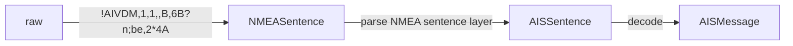

<div align="center">
    

  <h3 align="center">pyais</h3>

  <p align="center">
    AIS message encoding and decoding. 100% pure Python.
    <br />

[](https://pypi.org/project/pyais/)
[](https://github.com/M0r13n/pyais/blob/master/LICENSE)
[](https://codecov.io/gh/M0r13n/pyais)
[](https://pypi.org/project/pyais/)

[](https://pyais.readthedocs.io/en/latest/?badge=latest)

  </p>
</div>

---

Supports AIVDM/AIVDO messages. Supports single messages, files and
TCP/UDP sockets. This library has been used and tested extensively in representative real-world scenarios. This includes tests with live feeds from [Spire](https://spire.com/maritime/), the [Norwegian Coastal Administration](https://kystverket.no/en/navigation-and-monitoring/ais/access-to-ais-data/) and others. I test each major release against a selection of public and non-public data sources to ensure the broadest possible compatibility.

You can find the full documentation on [readthedocs](https://pyais.readthedocs.io/en/latest/).

Binary releases (Debian packages) are provided by the [pyais-debian](https://github.com/M0r13n/pyais-debian) starting with version **v2.5.6**. They are downloadable under the [Releases](https://github.com/M0r13n/pyais/releases) page.

# Acknowledgements

The HolAdo framework (https://gitlab.com/holado_framework/python) provides BDD features for multiple libraries, including an AIS module that utilizes pyais and has been deployed at [Kineis](https://www.kineis.com/en/about-us/) for space-based AIS message decoding.

# General

AIS (Automatic Identification System) is a communication system that allows ships to automatically exchange information such as vessel identification, position, course, and speed. This information is transmitted via VHF radio and can be received by other ships and coastal stations, allowing them to accurately determine the location and movement of nearby vessels. AIS is often used for collision avoidance, traffic management, and search and rescue operations. AIS messages are often transmitted via NMEA 0183.

NMEA (National Marine Electronics Association) is an organization that develops and maintains standards for the interface of marine electronic equipment. NMEA 0183 is a standard for communicating marine instrument data between equipment on a boat. It defines the electrical interface and data protocol for sending data between marine instruments such as GPS, sonar, and autopilot.

Here is an example of an AIS sentence:

`!AIVDM,1,1,,B,15MwkT1P37G?fl0EJbR0OwT0@MS,0*4E`

This AIS sentence is known as a "Position Report" message and is used to transmit information about a vessel's position, course, and speed. AIS messages are transmitted in digital format and consist of a series of comma-separated fields that contain different types of data. Here is a breakdown of each field in this particular sentence:

- **!AIVDM**: This field indicates that the sentence is an AIS message in the "VDM" (VDO Message) format.
- **1,1**: These fields indicate the total number of sentences in the message and the current sentence number, respectively. In this case, the message consists of a single sentence.
- : This field is left blank. This field can contain the sequence number.
- **B**: This field indicates the communication channel being used to transmit the message. In this case, the channel is "B".
- **15MwkT1P37G?fl0EJbR0OwT0@MS**: This field contains the payload of the message, which is encoded using a variant of ASCII known as "Six-bit ASCII". The payload contains information such as the vessel's identification, position, course, and speed.
- **0\*4E**: This field is a checksum that is used to verify the integrity of the sentence.

**pyais** is a Python module to encode and decode AIS messages.

# Installation

The project is available at [PyPI](https://pypi.org/project/pyais/) and can be installed with pip:

```shell
$ pip install pyais
```

**NOTE**: There is an experimental version on a branch [`experimental-version-without-bit-array`](https://github.com/M0r13n/pyais/tree/experimental-version-without-bit-array). This version does not depend on the bitarray module. It is as fast as the regular version of pyais when using CPython. But it is ~4 times faster when using PyPy.

# Usage

There are many examples in the [examples directory](https://github.com/M0r13n/pyais/tree/master/examples).

Decode a single part AIS message using `decode()`::

```py
from pyais import decode

decoded = decode(b"!AIVDM,1,1,,B,15NG6V0P01G?cFhE`R2IU?wn28R>,0*05")
print(decoded)
```

The `decode()` functions accepts a list of arguments: One argument for every part of a multipart message::

```py
from pyais import decode

parts = [
    b"!AIVDM,2,1,4,A,55O0W7`00001L@gCWGA2uItLth@DqtL5@F22220j1h742t0Ht0000000,0*08",
    b"!AIVDM,2,2,4,A,000000000000000,2*20",
]

# Decode a multipart message using decode
decoded = decode(*parts)
print(decoded)
```

Also the `decode()` function accepts either strings or bytes::

```py
from pyais import decode

decoded_b = decode(b"!AIVDM,1,1,,B,15NG6V0P01G?cFhE`R2IU?wn28R>,0*05")
decoded_s = decode("!AIVDM,1,1,,B,15NG6V0P01G?cFhE`R2IU?wn28R>,0*05")
assert decoded_b == decoded_s
```

Decode the message into a dictionary::

```py
from pyais import decode

decoded = decode(b"!AIVDM,1,1,,B,15NG6V0P01G?cFhE`R2IU?wn28R>,0*05")
as_dict = decoded.asdict()
print(as_dict)
```

Read a file::

```py
from pyais.stream import FileReaderStream

filename = "sample.ais"

with FileReaderStream(filename) as stream:
    for msg in stream:
        decoded = msg.decode()
        print(decoded)
```

Decode a stream of messages (e.g. a list or generator)::

```py
from pyais import IterMessages

fake_stream = [
    b"!AIVDM,1,1,,A,13HOI:0P0000VOHLCnHQKwvL05Ip,0*23",
    b"!AIVDM,1,1,,A,133sVfPP00PD>hRMDH@jNOvN20S8,0*7F",
    b"!AIVDM,1,1,,B,100h00PP0@PHFV`Mg5gTH?vNPUIp,0*3B",
    b"!AIVDM,1,1,,B,13eaJF0P00Qd388Eew6aagvH85Ip,0*45",
    b"!AIVDM,1,1,,A,14eGrSPP00ncMJTO5C6aBwvP2D0?,0*7A",
    b"!AIVDM,1,1,,A,15MrVH0000KH<:V:NtBLoqFP2H9:,0*2F",
]
for msg in IterMessages(fake_stream):
    print(msg.decode())
```

## Live feed

The [Norwegian Coastal Administration](https://kystverket.no/en/navigation-and-monitoring/ais/access-to-ais-data/) offers real-time AIS data.
This live feed can be accessed via TCP/IP without prior registration.
The AIS data is freely available under the [norwegian license for public data](https://data.norge.no/nlod/no/1.0):

Data can be read from a TCP/IP socket and is encoded according to IEC 62320-1:

- IP: 153.44.253.27
- Port: 5631

Refer to the [examples/live_stream.py](./examples/live_stream.py) for a practical example on how to read & decode AIS data from a TCP/IP socket.
This is useful for debugging or for getting used to pyais.

## Encode

It is also possible to encode messages.

| :exclamation: Every message needs at least a single keyword argument: `mmsi`. All other fields have most likely default values. |
| ------------------------------------------------------------------------------------------------------------------------------- |

### Encode data using a dictionary

You can pass a dict that has a set of key-value pairs:

- use `from pyais.encode import encode_dict` to import `encode_dict` method
- it takes a dictionary of data and some NMEA specific kwargs and returns the NMEA 0183 encoded AIS sentence.
- only keys known to each message are considered
  - other keys are simply omitted
  - you can get list of available keys by looking at pyais/encode.py
  - you can also call `MessageType1.fields()` to get a list of fields programmatically for each message
- every message needs at least two keyword arguments:
  - `mmsi` the MMSI number to encode
  - `type` or `msg_type` the type of the message to encode (1-27)

**NOTE:**
This method takes care of splitting large payloads (larger than 60 characters)
into multiple sentences. With a total of 80 maximum chars excluding end of line per sentence, and 20 chars head + tail
in the nmea 0183 carrier protocol, 60 chars remain for the actual payload. Therefore, it returns a list of messages.

```py
from pyais.encode import encode_dict

data = {
    'course': 219.3,
    'lat': 37.802,
    'lon': -122.341,
    'mmsi': '366053209',
    'type': 1,
}
# This will create a type 1 message for the MMSI 366053209 with lat, lon and course values specified above
encoded = encode_dict(data, radio_channel="B", talker_id="AIVDM")[0]
```

### Create a message directly

It is also possible to create messages directly and pass them to `encode_payload`.

```py
from pyais.messages import MessageType5
from pyais.encode import encode_msg

payload = MessageType5.create(mmsi="123", shipname="Titanic", callsign="TITANIC", destination="New York")
encoded = encode_msg(payload)
print(encoded)
```

### CLI encoder

There is also a AIS JSON to NMEA Encoder for your CLI: `ais-encode`. It reads JSON from stdin and outputs encoded NMEA AIS messages to stdout. Refer to `ais-encode --help`.

# Under the hood



Decoding each AIS message is a three step process.

At first, the NMEA 0183 physical protocol layer is parsed. The NMEA layer is the outer protocol layer that is used by **many different** sentences/protocols for data transmission. Just like Ethernet can be used as a data link protocol to transfer data between nodes, the NMEA protocol can be used to transmit data between maritime equipment.

After the raw message was parsed into a `NMEASentence`, the inner protocol layer is parsed. While there are **tons** of different inner protocols that build upon NMEA, **pyais** currently only supports AIS sentences. Every `AISSentence` holds basic information about the AIS message like:

- the AIS message ID
- the number of fill bits required for ASCII6 encoding
- the fragment count and fragment number
- the actual AIS payload
- the sequence number

Finally, the AIS payload is decoded based on the AIS ID. There are 27 different types of top level messages that are identified by their AIS ID.

# Tag block

Some messages may look strange at first. Typical AIS messages look roughly like this:

```txt
!AIVDM,1,1,,A,16:=?;0P00`SstvFnFbeGH6L088h,0*44
!AIVDM,1,1,,A,16`l:v8P0W8Vw>fDVB0t8OvJ0H;9,0*0A
!AIVDM,1,1,,A,169a:nP01g`hm4pB7:E0;@0L088i,0*5E
```

But sometimes such messages look something like this:

```
\s:2573135,c:1671620143*0B\!AIVDM,1,1,,A,16:=?;0P00`SstvFnFbeGH6L088h,0*44
\s:2573238,c:1671620143*0B\!AIVDM,1,1,,A,16`l:v8P0W8Vw>fDVB0t8OvJ0H;9,0*0A
\s:2573243,c:1671620143*0B\!AIVDM,1,1,,A,169a:nP01g`hm4pB7:E0;@0L088i,0*5E
```

These three messages are the same messages as above - only with a prefix, the **so called tag block.**
Tag blocks are essential key-value pairs that are wrapped between `\`s.
Every valid NMEA sentence may have **one of the these tag blocks**.
Tag blocks are used to hold extra information and somewhat similar to [Gatehouse messages](#gatehouse-wrappers).

A **tag block** consists of any number of comma-separated key-value pairs, followed by a checksum:

- `s:2573135,c:1671620143*0B` -> `s:2573135` & `c:1671620143` & `0*B`

The checksum is the same as for all NMEA messages.
Regarding the key value pairs:

- each key is a single letter
- each letter represents a field:
  - **c**: Receiver timestamp in Unix epoch (e.g. `1671620143`)
  - **d**: Destination station (e.g. `FooBar`)
  - **n**: Line count (e.g. `123`)
  - **r**: Relative time
  - **s**: Source station (e.g. `APIDSSRC1`)
  - **t**: Text (e.g. `Hello World!`)

Some things to keep in mind when working with **tag blocks** and **pyais**:

- tag blocks are optional (a message may or may not have a tag block)
- tag blocks are lazily decoded by pyais to save resources (need to call `tb.init()`)
- only some fields are supported by pyais (c,d,n,r,s,t)
  - unknown fields are simply omitted

## How to work with tag blocks

```py
from pyais.stream import IterMessages


text = """
\s:2573135,c:1671620143*0B\!AIVDM,1,1,,A,16:=?;0P00`SstvFnFbeGH6L088h,0*44
\s:2573238,c:1671620143*0B\!AIVDM,1,1,,A,16`l:v8P0W8Vw>fDVB0t8OvJ0H;9,0*0A
\s:2573243,c:1671620143*0B\!AIVDM,1,1,,A,169a:nP01g`hm4pB7:E0;@0L088i,0*5E
"""

messages = [line.encode() for line in text.split() if line]

with IterMessages(messages) as s:
    for msg in s:
        if msg.tag_block is not None:
            # Not every message has a tag block
            # Therefore, check if the tag block is not None
            # Also, it is required to call `.init()`, because tag blocks are lazily parsed
            msg.tag_block.init()
            # Print the tag block data as a dictionary
            print(msg.tag_block.asdict())
        print(msg.decode())
```

## Tag Block Queue (grouping)

Every class that implements the streaming API accepts an optional keyword argument `tbq`, which is set to `None` by default. When tbq is provided, it can be used as a queue for handling NMEA tag blocks. The queue's `get_nowait()` method allows you to retrieve a list of NMEASentence objects, but only when the entire group has been received (i.e., all sentences within the group are complete). It is important to note that this is rudimentary support for tag block groups, as pyais primarily focuses on processing AIS messages and abstracts away NMEA sentences from the user.

```py
with FileReaderStream('/path/to/file.nmea', tbq=TagBlockQueue()) as stream:
    tbq = stream.tbq

    for msg in stream:
        try:
            print(tbq.get_nowait())
        except queue.Empty:
            pass
```

# Gatehouse wrappers

Some AIS messages have so-called Gatehouse wrappers. These encapsulating messages contain extra information, such as time and checksums. Some readers also process these. See some more documentation [here](https://www.iala-aism.org/wiki/iwrap/index.php/GH_AIS_Message_Format).

As an example, see the following, which is followed by a regular `!AIVDM` message

```
$PGHP,1,2020,12,31,23,59,58,239,0,0,0,1,2C*5B
```

Such messages are parsed by **pyais** only when using any of the classes from **pyais.stream**.
e.g. `FileReaderStream` or `TCPStream`.

Such additional information can then be accessed by the `.wrapper_msg` of every `NMEASentence`. This attribute is `None` by default.

# Communication State

The ITU documentation provides details regarding the Time-division multiple access (TDMA) synchronization.

Such details include information used by the slot allocation algorithm (either SOTDMA or ITDMA) including their synchronization state.

Refer to [readthedocs](https://pyais.readthedocs.io/en/latest/messages.html#communication-state) for more information.

# Preprocessing

The `PreprocessorProtocol` is designed to provide flexibility in handling different message formats. By implementing this protocol, users can create custom preprocessors that transform input messages into the required NMEA0183 format before further processing.

## Definition

```py
import typing

class PreprocessorProtocol(typing.Protocol):
    def process(self, line: bytes) -> bytes:
        pass
```

where `process` is defined as:

```py
def process(self, line: bytes) -> bytes:
    pass
```

Parameters:
line (bytes): The input line in bytes that needs to be processed.
Returns:
bytes: The processed line in bytes, conforming to the NMEA0183 format.

The `process` method is responsible for transforming the input bytes into a format that adheres to the NMEA0183 standard. This method must be implemented by any class that conforms to the `PreprocessorProtocol`.

The custom preprocessor implementing the PreprocessorProtocol can be passed as an optional keyword argument (default None) to any class that implements the streaming protocol, excluding `IterMessages()`.

See [the preprocess example](./examples/preprocess.py) for an example implementation.

# AIS Filters

The filtering system is built around a series of filter classes, each designed to filter messages based on specific criteria. Filters are chained together using the `FilterChain` class, which allows combining multiple filters into a single, sequential filtering process. The system is flexible, allowing for the easy addition or removal of filters from the chain.

### How It Works

1. **AIS Stream**: Messages are provided as a stream to the filters.
2. **Filter Application**: Each filter in the chain applies its criteria to the stream, passing the messages that meet the criteria to the next filter.
3. **Filter Chain**: The `FilterChain` class orchestrates the passing of messages through each filter, from the first to the last.

## Filters

### 1. AttributeFilter

- **Description**: Filters messages based on a user-defined function.
- **Usage**: Initialize with a function that takes an AIS message and returns `True` if the message should be kept.

### 2. NoneFilter

- **Description**: Filters out messages where specified attributes are `None`.
- **Usage**: Initialize with the names of attributes that should not be `None` in the messages.

### 3. MessageTypeFilter

- **Description**: Filters messages based on their type.
- **Usage**: Initialize with message types to include.

### 4. DistanceFilter

- **Description**: Filters messages based on distance from a reference point.
- **Usage**: Initialize with a reference point (latitude and longitude) and a distance threshold in kilometers.

### 5. GridFilter

- **Description**: Filters messages based on whether they fall within a specified geographical grid.
- **Usage**: Initialize with the boundaries of the grid (minimum and maximum latitude and longitude).

## Utility Functions

### 1. Haversine

- **Description**: Calculates the great circle distance between two points on the Earth.
- **Parameters**: Takes two tuples representing the latitude and longitude of each point.
- **Returns**: Distance between the points in kilometers.

### 2. Is In Grid

- **Description**: Checks if a point is within a defined geographical grid.
- **Parameters**: Latitude and longitude of the point and the boundaries of the grid.
- **Returns**: `True` if the point is within the grid, `False` otherwise.

## FilterChain

- **Description**: Chains multiple filters together into a single filtering process.
- **Usage**: Initialize with a list of filters to be applied in order. The chain can be used to filter a stream of AIS messages.

## Example Usage

```python
from pyais import decode, TCPConnection
# ... (importing necessary classes)

# Define and initialize filters
attribute_filter = AttributeFilter(lambda x: not hasattr(x, 'turn') or x.turn == -128.0)
none_filter = NoneFilter('lon', 'lat', 'mmsi2')
message_type_filter = MessageTypeFilter(1, 2, 3)
distance_filter = DistanceFilter((51.900, 5.320), distance_km=1000)
grid_filter = GridFilter(lat_min=50, lon_min=0, lat_max=52, lon_max=5)

# Create a filter chain
chain = FilterChain([
    attribute_filter,
    none_filter,
    message_type_filter,
    distance_filter,
    grid_filter,
])

# Decode AIS data and filter
stream = TCPConnection(...)
filtered_data = list(chain.filter(stream))

for msg in filtered_data:
    print(msg.lat, msg.lon)
```

# AIS tracker

**pyais** comes with the the ability to collect and maintain the state of individual vessels over time.
This is necessary because several messages can give different information about a ship.
In addition, the data changes constantly (e.g. position, speed and course).

Thus the information split across multiple different AIS messages needs to be collected, consolidated and aggregated as a single track.
This functionality is handled by the `AISTracker` class.

**NOTE:** Each track (or vessel) is solely identified by its MMSI.

```py
import pathlib

from pyais import AISTracker
from pyais.stream import FileReaderStream

filename = pathlib.Path(__file__).parent.joinpath('sample.ais')

with FileReaderStream(str(filename)) as stream:
    with AISTracker() as tracker:
        for msg in stream:
            tracker.update(msg)
            latest_tracks = tracker.n_latest_tracks(10)

# Get the latest 10 tracks
print('latest 10 tracks', ','.join(str(t.mmsi) for t in latest_tracks))

# Get a specific track
print(tracker.get_track(249191000))
```

Unlike most other trackers, `AISTracker` handles out of order reception of messages.
This means that it is possible to pass messages to update() whose timestamp is
older that of the message before. The latter is useful when working with multiple stations
and/or different kinds of metadata.

But this comes with a performance penalty. In order to cleanup expired tracks and/or to get the latest N tracks the tracks need to be sorted after their timestamp. Thus, `cleanup()` and `n_latest_tracks()` have a complexity of `O(N * log(N))`. Depending on the number of messages in your stream this may or may not be good enough.

If you know that your messages in your stream are ordered after their timestamp and/or you never pass a custom timestamp to `update()`, you <mark>should set the `stream_is_ordered=True` flag when creating a new `AISTracker` instance</mark>. If this flag is set `AISTracker` internally stores the tracks in order. Thus, `cleanup()` and `n_latest_tracks()` have a complexity of `O(k)`.

## Callbacks

It is possible to register event listeners as callbacks,
so that you are is instantly notified whenever a track is created, updated, or deleted.

```py
import pyais
from pyais.tracker import AISTrackEvent

host = '153.44.253.27'
port = 5631


def handle_create(track):
    # called every time an AISTrack is created
    print('create', track.mmsi)


def handle_update(track):
    # called every time an AISTrack is updated
    print('update', track.mmsi)


def handle_delete(track):
    # called every time an AISTrack is deleted (pruned)
    print('delete', track.mmsi)


with pyais.AISTracker() as tracker:
    tracker.register_callback(AISTrackEvent.CREATED, handle_create)
    tracker.register_callback(AISTrackEvent.UPDATED, handle_update)
    tracker.register_callback(AISTrackEvent.DELETED, handle_delete)

    for msg in pyais.TCPConnection(host, port=port):
        tracker.update(msg)
        latest_tracks = tracker.n_latest_tracks(10)
```

# Performance Considerations

You may refer to
the [Code Review Stack Exchange question](https://codereview.stackexchange.com/questions/230258/decoding-of-binary-data-ais-from-socket)
. After a some research I decided to use the bitarray module as foundation. This module uses a C extension under the
hood and has a nice user interface in Python. Performance is also great. Decoding
this [sample](https://www.aishub.net/ais-dispatcher) with roughly 85k messages takes **less than 6 seconds** on my
machine. For comparison, the C++ based [libais module](https://github.com/schwehr/libais) parses the same file in \~ 2
seconds.

# Disclaimer

This module is a private project of mine and does not claim to be complete. I try to improve and extend it, but there
may be bugs. If you find such a bug feel free to submit an issue or even better create a pull-request. :-)

# Coverage

Currently, this module is able to decode most message types. There are only a few exceptions. These are messages that
only occur in very rare cases and that you will probably never observe. The module was able to completely decode a 4
hour stream with real-time data from San Francisco Bay Area without any errors or problems. If you find a bug or missing
feature, please create an issue.

# Known Issues

During installation, you may encounter problems due to missing header files. The error looks like this:

```sh
...

    bitarray/_bitarray.c:13:10: fatal error: Python.h: No such file or directory
       13 | #include "Python.h"
          |          ^~~~~~~~~~
    compilation terminated.
    error: command 'x86_64-linux-gnu-gcc' failed with exit status 1

...

```

In order to solve this issue, you need to install header files and static libraries for python dev:

```sh
$ sudo apt install python3-dev
```

# For developers

After you cloned the repo head into the `pyais` base directory.

Then install all dependencies:

```sh
$ pip install .[test]
```

Make sure that all tests pass and that there aren't any issues:

```sh
$ make test
```

Now you are ready to start developing on the project! Don't forget to add tests for every new change or feature!

# Docker

Use Docker to run your application inside a container. At first you need to build the image locally:

`docker build . -t pyais`

Afterwards, run the container (bash):

`docker run -it --rm pyais /bin/bash`

You can then run the examples inside the container:

`python ./examples/live_stream.py`

# Funfacts

## Python3.11 is faster

With Python3.11 significant improvements to the CPython Runtime were made:

- [What's new with Python 3.11](https://docs.python.org/3/whatsnew/3.11.html)
- [Faster CPython](https://docs.python.org/3/whatsnew/3.11.html#whatsnew311-faster-cpython)

Some results from the internal [performance test](https://github.com/M0r13n/pyais/blob/master/tests/test_file_stream.py#L155):

**3.10:**
`Decoding 82758 messages took: 3.233757972717285`

**3.11:**
`Decoding 82758 messages took: 2.5866270065307617`
